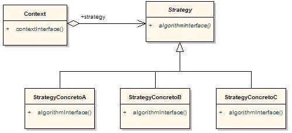

# Patron Strategy

#### El patrón de diseño Strategy es un patrón comportamental que permite cambiar el comportamiento de un objeto en tiempo de ejecución. Este patrón se basa en encapsular un algoritmo dentro de una clase, y luego utilizar diferentes instancias de dicha clase para cambiar el comportamiento de un objeto en tiempo de ejecución.




#### En este diagrama, podemos ver tres clases principales: Context, Strategy y ConcreteStrategy. La clase Context es la clase que utiliza el patrón Strategy, y es la que contiene una referencia a una instancia de la clase Strategy. La clase Strategy es una clase abstracta que define la interfaz que deben implementar las clases concretas. Finalmente, la clase ConcreteStrategy es una clase concreta que implementa el algoritmo específico.

#### Para entender mejor cómo funciona este patrón, mostraremos un ejemplo practico.
```
Supongamos que tenemos una aplicación que permite a los usuarios buscar vuelos. 
La aplicación permite a los usuarios buscar vuelos de dos maneras diferentes: por precio y por tiempo de vuelo.
```
#### Para implementar esto utilizando el patrón de diseño Strategy, primero crearíamos una clase abstracta SearchStrategy que define la interfaz para las clases concretas PriceSearchStrategy y TimeSearchStrategy.
# Por cierto este patron utiliza polimorfismo, dos pajaros de un tiro!

```ts
interface Flight {
    price: number;
    timeOfFlight: number //medido en minutos
}

const getFlights = (): Flight[] => [{ price: 10, timeOfFlight: 200 }, { price: 20, timeOfFlight: 100 }]


interface SearchStrategy {
    search(): Flight[];
}


class PriceSearchStrategy implements SearchStrategy {
    search(): Flight[] {
        console.log('Buscando vuelos por precio');
        const flights: Flight[] = getFlights().sort((a,b) => a.price - b.price);
        return flights;
    }
}

class TimeSearchStrategy implements SearchStrategy {
    search(): Flight[] {
        console.log('Buscando vuelos por tiempo de vuelo');
        const flights: Flight[] = getFlights().sort((a,b) => a.timeOfFlight - b.timeOfFlight);
        return flights;
    }
}

class FlightSearch {
    private strategy: SearchStrategy;

    constructor(strategy: SearchStrategy) {
        this.strategy = strategy;
    }

    searchFlights(): Flight[] {
        return this.strategy.search();
    }
}

const getSearchOption = (): string => ['price', 'timeOfFlight'][Math.floor(Math.random() * 2)]

const searchOption: string = getSearchOption();

let strategy: SearchStrategy;

if (searchOption === "price") {
    strategy = new PriceSearchStrategy();
} else {
    strategy = new TimeSearchStrategy();
}

const search = new FlightSearch(strategy);
const results = search.searchFlights();
console.log(results)
```

### Podemos mostrar este ejemplo funcionando en [playground](https://www.typescriptlang.org/play?#code/Q) o ejecutando este comando 
```
ts-node-dev design-pattern/code/index.ts
```

